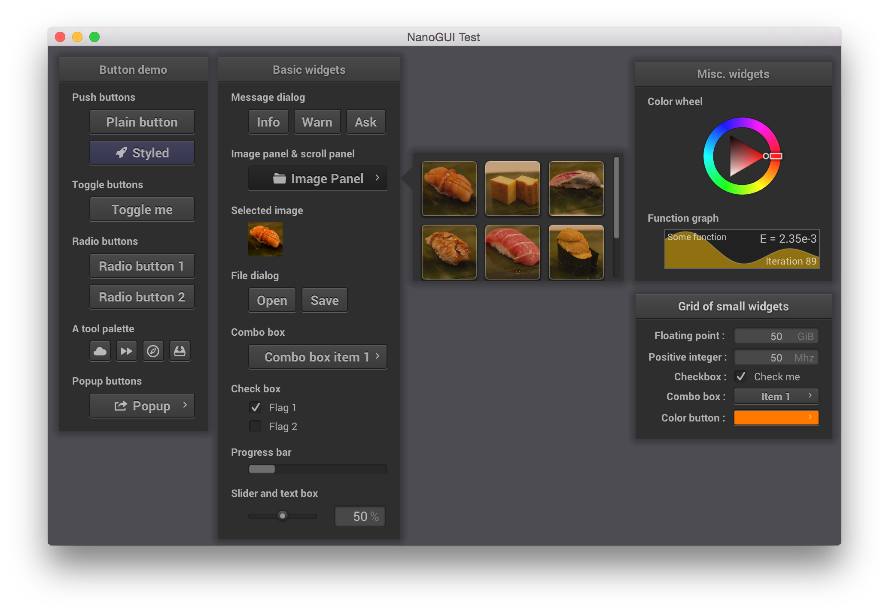
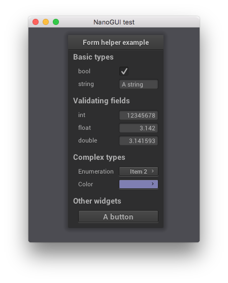

NanoGUI
========================================================================================

.. include:: ../README.rst
   :start-after: begin_brief_description
   :end-before:  end_brief_description

Example Screenshot
----------------------------------------------------------------------------------------

Description
----------------------------------------------------------------------------------------

.. include:: ../README.rst
   :start-after: begin_long_description
   :end-before:  end_long_description

"Simple mode"
----------------------------------------------------------------------------------------

Christian Schüller contributed a convenience class that makes it possible to create
AntTweakBar-style variable manipulators using just a few lines of code. Refer to
:ref:`nanogui_example_2` for how to create the image below.

License
----------------------------------------------------------------------------------------

.. include:: ../README.rst
   :start-after: begin_license
   :end-before:  end_license

.. note::

   The CC BY-SA 4.0 license should not be an issue for most projects.  However, you can
   adopt a different font for icons if you need.  See :ref:`nanogui_including_custom_fonts`.

Contents
========================================================================================

.. toctree::
   :maxdepth: 2

   usage
   compilation
   examples
   api/library_root
   contributing

Indices and tables
==================

* :ref:`genindex`
* :ref:`modindex`
* :ref:`search`
